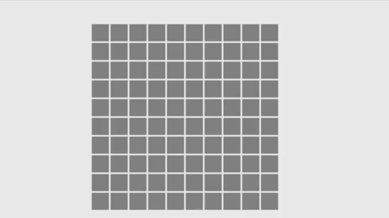

[Click Here for Demo](https://jevan1000.github.io/Minesweeper/)

## Installation
Everything is provided simply open "index.html" and everything should
work properly.

The application was developed in the chrome browser 
and untested in other browsers.

Requires the following packages: (included)
- d3.v4.min.js

Note: Included inside the "includes" folder. 
